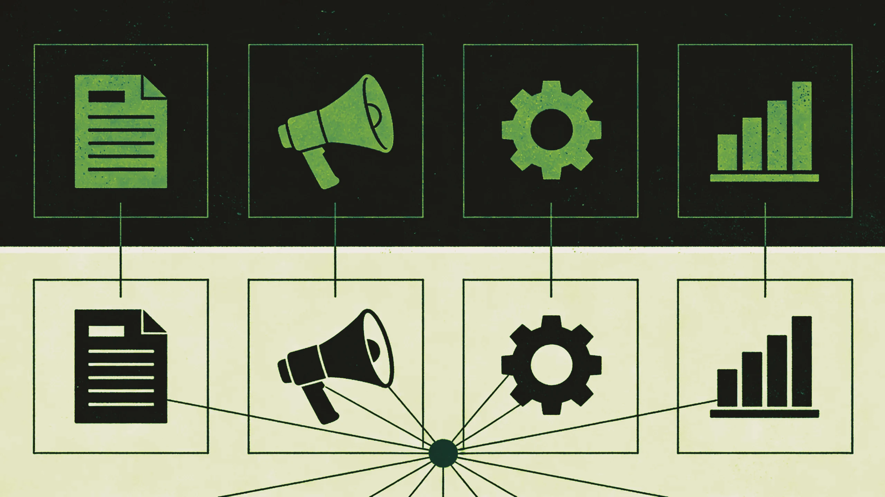

Your LinkedIn feed is full of people telling you that agentic AI is going to transform your marketing department. Most of them are selling something. This is not that article.

What follows is a working definition of what agentic AI actually is, a walk through where it can realistically help a B2B marketing team, and an honest account of where the gap between the demo and the daily reality still sits. If you are managing a marketing function of three to eight people, no dedicated AI or tech resource, and a budget somewhere between €200K and €1M, this is written specifically for you.

## Start with the words, because they matter

The term "agentic AI" gets used to mean a lot of different things, which is part of the problem.

Here is the clearest distinction: generative AI creates content in response to a prompt. You type something, it produces something, the interaction ends there. Agentic AI takes that a step further. An agent is a system that can set a sub-goal, take a sequence of actions to reach it, observe the result of those actions, and adjust course. It does not wait for you to prompt every step.

Think of it this way. A generative AI tool is a very capable intern who needs detailed instructions for each task. An agentic AI system is more like an autonomous process: you give it an objective, it works through the steps, and it reports back when it is done or when it needs your input.

The reason this matters practically is that most of the value in marketing is not in producing one piece of content. It is in the sequence of steps around it: research, brief, draft, review loop, publish, distribute, track. Generative AI helps with individual steps. Agentic AI can handle sequences.

## What this actually looks like in a B2B marketing team

Let me walk through four functional areas and be specific about what is realistic today.

**Content production**

The most mature application. An agentic workflow for content might look like this: you brief a topic, the agent researches the keyword landscape, drafts an outline, generates a full draft, checks it against a brand guide, flags sections for review, and stages it for publication once approved. The human is in the loop for review and editorial judgment, but is not doing the mechanical work at every step.

For a team producing four to six articles per month, this is meaningful time recovery. The bottleneck moves from production to editorial quality, which is where your attention should be anyway.

**Demand generation and outreach**

More complex, more powerful, more room for things to go wrong. Agentic systems can research accounts, pull intent signals, draft personalised sequences, monitor response patterns, and adjust messaging. The technology works. The risk is that when it fails, it can fail at scale, and in B2B, a poorly researched outreach message leaves a mark that is hard to undo.

The practical approach: use agents for research and draft preparation, keep a human in the loop before anything reaches a contact.

**Marketing operations**

This is where agentic AI quietly delivers the most value for mid-market teams. Keeping CRM data clean. Routing leads. Flagging anomalies in campaign performance. Updating dashboards. These are tasks that fall through the cracks precisely because no single person owns them and they do not justify a full-time hire. An agentic system running in the background is well suited to this pattern: check, compare against a rule, flag or act.

**Reporting and analysis**

If your team spends two days at the end of each month assembling a performance report, this is probably where agentic AI has the most immediate ROI. Connect the data sources, define the narrative structure, let the agent pull the numbers and write the first draft of the commentary. You review and distribute. Not zero effort, but a fraction of the current one.

## The difference between standalone tools and orchestration

Here is a distinction that matters more than most people acknowledge.

Most AI tools you can buy today are standalone. You log in, you use the tool, you get an output, you take it somewhere else. This is still useful. But it is not agentic in the meaningful sense.

True agentic systems require orchestration: the ability to connect multiple tools, pass information between them, act on external triggers, and maintain a thread of context across time. This requires either a platform that manages the orchestration layer for you, or someone on your team who can build and maintain it.

For a team of five with no dedicated tech resource, the honest answer is this: start with the standalone applications that save real time today. The orchestrated, multi-step workflows are not out of reach, but they require either a vendor who has already done the integration work or a partner who can set it up and hand it over to your team fully operational.

## A realistic entry point

The worst thing you can do is buy a platform, spend three months trying to implement it, and conclude that agentic AI does not work. It is not the technology that fails in those situations. It is the deployment approach.

A better starting point: pick one high-friction, repeatable task that your team does every week. Something that follows a clear pattern and currently takes more time than it should. Map the steps. Then ask whether any of the tools you already have, or a lightweight addition, can automate the sequence.

For most mid-market B2B marketing teams, the first agentic win is in content research and briefing, or in lead routing and CRM hygiene. Not because those are the most exciting use cases, but because they are the most bounded. Clear inputs, clear outputs, easy to verify that it is working.

From there, you build intuition. You see where the edge cases are. You start asking bigger questions about what else could run this way.

## Three things that consistently go wrong

**Starting with the platform instead of the problem.** If you are evaluating AI tools before you have identified the specific friction you want to remove, you are going to be sold a general solution to a specific situation. Start with the problem, then find the tool.

**Assuming your data is ready.** Most mid-market B2B companies have CRM data that is partially adopted and not particularly reliable. Agentic systems that depend on data quality will amplify whatever quality problems you already have. Before you automate, clean.

**Underestimating the review layer.** Autonomous does not mean unmonitored. Any agentic system touching external communication needs a human review gate. The efficiency gain is in removing the manual drafting and research work, not in removing judgment from customer-facing decisions.

---

*Agentic AI in B2B marketing is not a transformation story yet. For most teams, it is a series of incrementally better workflows that, taken together, free up meaningful capacity. That is not a small thing when your team is already stretched and the expectations on marketing have not gotten any smaller.*

*If you are trying to figure out where to start or whether your current setup is ready for it, that is exactly the kind of question we work through with clients. No pitch. Just a conversation.*
