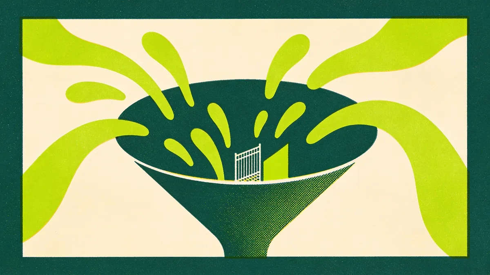

El discurso que oyes una y otra vez sobre la IA en el stack de marketing B2B es simple y está equivocado: automatiza todo, reduce el equipo a la mitad y mira cómo el pipeline se cuida solo. Es una historia seductora, y trata la automatización como un interruptor. Lo enciendes y te vas. Pero la IA en una función de marketing B2B no es un interruptor. Es un bisturí. Usado con precisión, elimina horas de trabajo penoso que nadie debería estar haciendo a mano. Usado como un mazo, destruye las dos cosas sobre las que se mueve de verdad tu marketing: la confianza y el criterio.

Esa es la parte que el hype se salta. En B2B la venta es lenta, el comité de compra es escéptico y la relación es el producto. La gente compra a quien cree. Automatiza las partes equivocadas de eso y no consigues apalancamiento. Consigues una forma más rápida de sonar como todos los demás, y una forma más silenciosa de perder la credibilidad que tardaste años en construir.

Así que la pregunta nunca fue "¿deberíamos usar IA?". Deberías. La pregunta es *dónde*. Y resulta que eso tiene una respuesta clara.

## El único eje que lo decide todo

Olvida por un momento las listas de herramientas y las comparativas de features. Hay un único eje que ordena casi cualquier tarea de marketing con limpieza, y es este: **¿cuánto criterio exige esto y cuánto define la relación?**

En un extremo tienes trabajo repetible, de mucho volumen y de poco criterio. Hay una respuesta correcta, o casi, y hacerlo a mano es puro esfuerzo estéril. En el otro extremo tienes trabajo de mucho criterio, que define la relación y da forma a la marca. No hay plantilla. El valor *es* la decisión humana.

Automatiza el primer extremo sin dudar. Agregar research de treinta fuentes en un briefing. Transcribir y etiquetar llamadas de cliente. Limpiar un export sucio del CRM. Generar doce variantes de asunto para testear. Convertir un webinar terminado en un primer borrador de resumen. Reformatear un informe que si no montarías a mano a las 6 de la tarde. Este es el trabajo bruto que se come la semana de tu equipo y no premia nada de su talento. Pásaselo a la máquina y recupera las horas.

Deja el segundo extremo en manos humanas, de forma deliberada y visible. Estrategia y posicionamiento. La edición final, donde vive el criterio. El outreach sensible a una cuenta que importa. El thought leadership de dirección. Cualquier cosa que el cliente vive *como* la relación. Esto no es nostalgia ni miedo a la herramienta. Es que el valor de este trabajo viene precisamente de que una persona tomó la decisión, y una máquina no puede fingir eso de una forma que tus compradores no acaben notando.

La mayoría de tareas se ordenan solas en cuanto las pones contra este eje. El terreno confuso del medio es más pequeño de lo que crees.

## Las cuatro formas de hacerlo al revés

Los modos de fallo son predecibles, porque todos comparten una raíz: automatizar la parte que se suponía que llevaba la señal humana.

**Automatizar el outreach personal a escala.** El más común y el más dañino. Coges el único canal que se supone que debe sentirse como que una persona notó algo específico de un prospecto, y lo conviertes en una máquina de volumen. El "Hola {Nombre}, me encantó tu post sobre {Tema}" que ahora todos huelen a un kilómetro. Al que lo recibe no le parece eficiente. Le parece spam con una etiqueta de nombre puesta, y quema justo la confianza que intentabas abrir.

**Escribir del todo como fantasma el thought leadership.** El LinkedIn de tu CEO, el punto de vista del fundador, la firma de un directivo. Los lectores lo notan. No siempre de forma consciente, pero sienten la ausencia de una opinión real, ese lodo pulido de texto que podría haber escrito cualquiera sobre cualquiera. Y es tu credibilidad la que está en juego, publicada bajo un nombre real. La IA puede redactar desde una posición humana genuina. No puede inventar la posición. Cuando lo intenta, obtienes una nada segura y bien formateada.

**Dejar que la IA fije la estrategia.** Dale a un modelo tu mercado y pregúntale qué deberías hacer, y te dará una respuesta fluida, razonable y media. Lo medio es el problema. La estrategia es una serie de apuestas sobre dónde vas a ganar *tú* en concreto, hechas con contexto y convicción que el modelo no tiene. Externaliza eso y habrás automatizado tu camino hacia el mismo plan que cualquier competidor que lanzó el mismo prompt.

**Automatizar el criterio de la última milla.** Este es el sutil. La IA hace el 90% de una tarea de maravilla, y la tentación es dejar que cierre también el 10% final. Pero esa última milla, la edición final, el chequeo de "¿esto de verdad conecta?", la decisión de cortar la frase ingeniosa que no sirve al lector, es donde se concentra el valor. Automatiza el esfuerzo penoso, por supuesto. Automatizar el criterio que se apoya encima regala la única parte que valía la pena pagar.

## Un test que puedes aplicar en diez segundos

Cuando una tarea cae en el terreno confuso del medio y el eje por sí solo no la resuelve, usa esto: **si lo hace una máquina y el cliente se entera, ¿perdemos confianza?**

Eso es todo. Pasa cualquier tarea por esa pregunta y la respuesta se afila rápido.

Si un cliente descubre que usaste IA para limpiar tus datos, resumir una llamada o redactar la primera versión de un informe, se encoge de hombros. Claro que lo hiciste. Eso es simplemente operar con competencia, y nadie se siente engañado. Pero si descubre que la nota "personal" de tu fundador la generó una máquina, o que la recomendación estratégica que presentaste era en realidad el output de un modelo sin editar, algo se rompe. No porque la IA sea el diablo, sino porque diste a entender que había una persona ahí y no la había. El engaño no es la automatización. Es la pretensión.

Cuando la respuesta al test es sí, perdemos confianza, mantén a una persona clara y realmente en el bucle. No como un sello de goma que deja pasar el output, sino como quien de verdad toma la decisión que el cliente cree que está tomando una persona. Cuando la respuesta es no, automatiza sin complejos y no te pongas precioso con ello.

Este test también mata de un solo golpe a los dos bandos extremos. Al maximalista que quiere automatizarlo todo le da una línea clara que no debe cruzar. Al escéptico que se niega a tocar la IA le quita la excusa, porque la mayor parte del trabajo pasa el test sin daño y debería haberse automatizado hace un año. Ninguno de los dos reflejos sobrevive al contacto con la pregunta real.

## Quita el esfuerzo penoso, no el criterio

Los equipos que sacan apalancamiento real de la IA en su stack de marketing B2B no son los que más automatizaron. Son los que automatizaron *lo correcto* y luego gastaron las horas recuperadas en el trabajo que solo pueden hacer las personas. Dejaron de quemar a su mejor gente en transcripciones y formateo, y apuntaron ese criterio liberado a la estrategia, a puntos de vista genuinamente originales, a las relaciones que cierran acuerdos de seis cifras.

Ese es todo el juego. La IA es extraordinaria quitando esfuerzo penoso. Se vuelve peligrosa en el momento en que le pides que quite criterio. Tu trabajo como quien monta el stack no es maximizar la automatización. Es trazar la línea en el sitio correcto, sostenerla y ser honesto contigo mismo sobre a qué lado pertenece cada tarea.

Acierta con esa línea y la IA se convierte en lo mejor que le ha pasado nunca al output de tu equipo. Fállala y escalarás la mediocridad más rápido de lo que jamás escalaste la calidad. Las herramientas son las mismas en ambos casos. El criterio sobre dónde apuntarlas es toda la diferencia, y esa, apropiadamente, no es una decisión que debas automatizar. Si quieres profundizar en trazar esa línea con intención, nuestro [trabajo de estrategia de IA](/es/services/ai-strategy) gira justo en torno a esto, y hay más ideas en nuestros [insights](/es/insights).

---

*En The B2B Tinkerers ayudamos a equipos B2B a usar la IA para quitar el esfuerzo penoso sin externalizar el criterio. Si estás intentando averiguar dónde cae esa línea en tu stack, [hablemos](#contact).*
