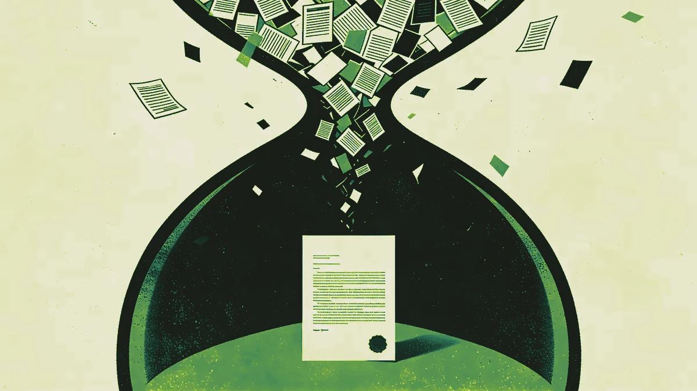
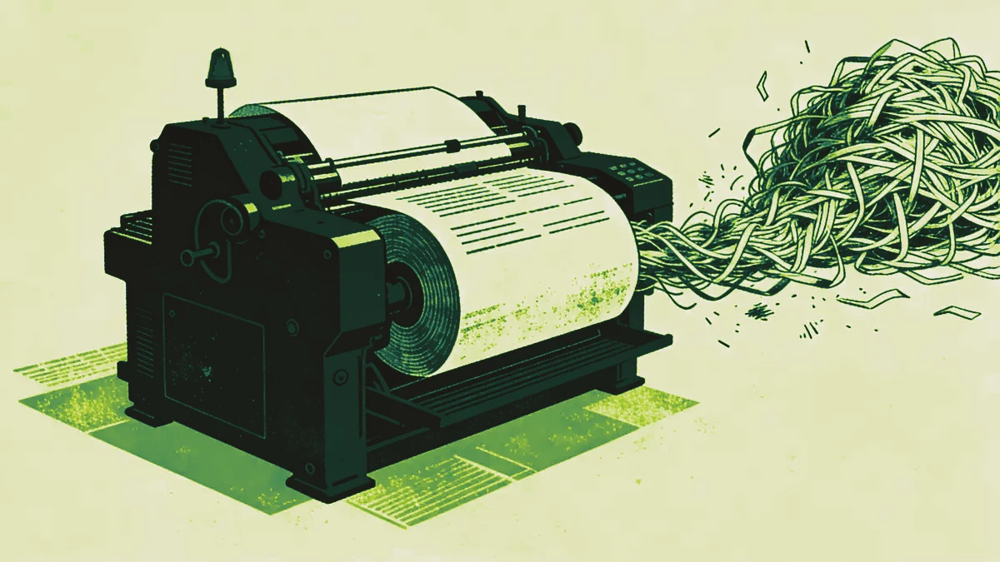

Every B2B marketing team is somewhere on the AI adoption curve. Most are further behind than they think — but not in the way they assume.

The conversation about AI in marketing has become almost impossible to have clearly. On one side, the hype machine is relentless: AI will replace your team, automate everything, generate infinite content at zero cost. On the other, a scepticism that's understandable but increasingly hard to justify: "we tried ChatGPT and the output was generic."

Both positions miss the point.

AI is not replacing B2B marketing teams. But it is already separating teams that know how to use it from those that don't — and that gap is widening faster than most marketing leaders want to admit.

## What's actually working right now

Let's be specific. The AI use cases generating real, measurable value in B2B marketing today are not the flashy ones.

**Research and synthesis.** The ability to process large volumes of information — competitor analysis, customer interview transcripts, market reports, sales call recordings — and extract structured insight is genuinely transformative. Work that took a week now takes an afternoon. The output isn't perfect. But it's a good first draft of something that would have been a blank page.

**Content at scale, with guardrails.** Not "generate a blog post." That almost never produces anything worth publishing without significant human editing. But "given this brief, this audience, and these three existing examples of our tone, generate five variations of this email subject line" — that works. The key is the guardrails: specific inputs, specific constraints, human judgment at the end.

**Personalisation infrastructure.** B2B buying committees are typically 6 to 10 people. Each of them cares about different things. AI makes it feasible — for the first time — to create genuinely personalised versions of content for different stakeholders at scale, without a team of 20 writers. This is still emerging, but the early results are significant.

**Faster iteration.** The biggest change for most marketing teams is not the quality of AI output but the speed of the loop. Test an idea, get feedback, iterate — in hours instead of days. For teams that were constrained by production time rather than ideas, this is genuinely freeing.

## What isn't working

**Autonomous content production.** The dream of "set it and run" AI content is not here yet for B2B. The output lacks the specific expertise, the industry nuance, the honest opinion that makes B2B content credible with a senior buyer. You can use AI to produce content faster. You cannot yet use it to produce content without a knowledgeable human in the loop.

**Lead scoring and intent data.** There's a lot of money being spent on AI-powered intent platforms. Some of it is well spent. Most of it is not — because the signal quality is poor, the integration with sales workflows is weak, and the teams using it don't have the operational discipline to act on signals quickly enough to make the data meaningful.

**AI-generated personalisation without strategy.** Personalisation at scale is only valuable if you have something worth personalising. Teams that have jumped to AI-powered personalisation without a clear segmentation strategy and differentiated messaging for each segment are just automating noise.

## The hybrid model

The frame we find most useful is this: AI is not a replacement for human judgment in B2B marketing. It's an amplifier of it.

A marketer with good judgment, deep customer understanding, and a clear strategic framework becomes dramatically more effective with AI tools. A marketer without those foundations becomes dramatically more efficient at producing the wrong things.

This is why the companies winning with AI in B2B marketing right now are not the ones that have deployed the most tools. They're the ones that have been most deliberate about where human expertise is irreplaceable — and where AI can remove the friction without removing the quality.

The practical version of this looks like: your best strategist spends less time on research and production, and more time on the decisions that require their specific knowledge and judgment. AI handles the grunt work. Humans handle the thinking.

## What to do next quarter

If you're a B2B marketing leader trying to make sense of this practically, here's what we'd suggest:

**Audit your current time spend.** Before buying any tools, understand where your team's time actually goes. In our experience, 40-60% of B2B marketing team time is spent on tasks that AI can handle well: research, first drafts, data compilation, reporting, briefing documents. That's your opportunity.

**Start with one workflow, not the whole stack.** Pick the single most time-consuming repeatable task your team does — content briefs, competitive analysis, email sequences, whatever it is — and build a proper AI workflow around it. One workflow done well teaches you more than five done badly.

**Invest in prompting as a skill.** The quality gap between teams using AI effectively and teams using it poorly is almost entirely explained by how they interact with the tools. Prompting is a skill. It can be taught. It's worth investing in.

**Don't automate what you haven't mastered manually.** If your messaging isn't working, AI-powered distribution will just amplify a problem. If your lead qualification process is broken, AI-powered scoring will make it faster and still broken. Fix the fundamentals first.

**Build the governance now.** AI-generated content creates legal, brand, and factual accuracy risks that most B2B marketing teams aren't managing properly yet. Build a review process before you scale, not after something goes wrong.

## The honest forecast

AI will change B2B marketing significantly over the next three years. The teams that are experimenting thoughtfully now — not chasing every new tool, but building real capability in specific areas — will have a meaningful advantage.

The teams that are waiting for it to "settle down" before engaging are already behind. The technology is not going to become simpler or less relevant. The learning curve is only going to get steeper the longer you wait.

Start small. Be specific. Keep the human judgment in the loop. Measure what changes.

That's not a revolutionary approach. But in a space full of hype and confusion, it's the one that actually works.

---

*We help B2B marketing teams build AI and hybrid marketing strategies that are grounded in business reality. If you're trying to work out where to start, that's exactly the kind of conversation we're good at.*
