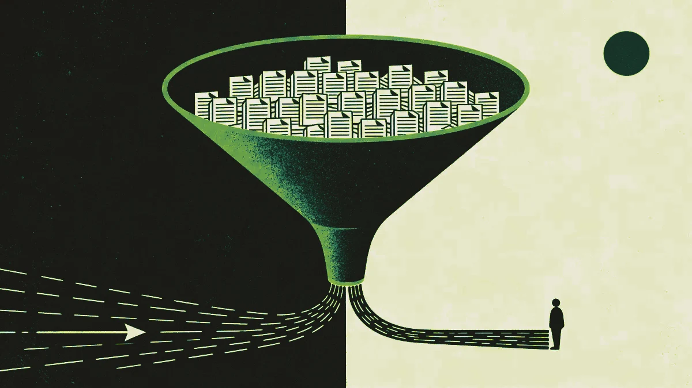

Cuando el cliente vino a nosotros, no estaba perdiendo clientes frente a un competidor. Los perdía frente a la espera.

El dueño de un negocio llama buscando cobertura de responsabilidad civil comercial. Lo enrutan a una cola. Un especialista en Manila coge la llamada, reúne la información, hace los números y devuelve la llamada. Para cuando llega la cotización, han pasado cuarenta minutos en un día bueno. En un día malo, el dueño del negocio ya ha seguido adelante.

El equipo no estaba rindiendo por debajo. Simplemente, el proceso no estaba construido para el volumen ni la velocidad que el mercado espera ahora.

## Cómo era la operación antes

El cliente opera en un segmento competitivo del mercado de seguros comerciales de EE. UU.: pymes y empresas del mid-market que buscan cobertura de responsabilidad civil general, workers' compensation y propiedad comercial. El tamaño de las operaciones va desde unos pocos miles de dólares hasta más de 80.000 $ de prima anual.

Su operación de cotización se apoyaba en un modelo que funcionaba bien hace diez años. Las solicitudes entrantes llegaban por teléfono y formulario web. Un equipo de especialistas formados, con base en Filipinas, se encargaba del triaje y la cotización inicial: reunir los datos del negocio, pasar la solicitud por los portales de las aseguradoras y devolver una cotización al prospecto.

El modelo tenía fortalezas reales. El equipo tenía experiencia, la calidad de las cotizaciones era alta y los especialistas conocían bien el producto. Pero tenía dos problemas estructurales que se agravaban a medida que crecía el volumen.

El primero era la velocidad. El tiempo medio desde el contacto inicial hasta la cotización entregada estaba entre 25 y 40 minutos. Para un dueño de negocio con tres pestañas abiertas comparando proveedores, esa ventana es demasiado larga.

El segundo era la cobertura horaria. El equipo de Manila operaba en una franja de turno definida. Las solicitudes de cotización que llegaban fuera de esas horas entraban en una cola y esperaban. En un mercado donde la competencia ofrece cada vez más respuestas instantáneas o casi instantáneas, esa brecha se estaba volviendo visible.

## La decisión de no reemplazar al equipo

La lectura más fácil y equivocada de este proyecto es enmarcarlo como automatización reemplazando a personas. No es lo que pasó y nunca fue el objetivo.

El equipo de especialistas del cliente tenía algo que ningún modelo puede replicar a corto plazo: conocimiento profundo del producto, la capacidad de manejar cuentas complejas y las dotes de relación para cerrar a un comprador nervioso. Reemplazarlos habría sido a la vez arriesgado operativamente y miope comercialmente.

El problema real era que el equipo dedicaba una parte desproporcionada de su tiempo a solicitudes sencillas que seguían un patrón predecible: códigos de sector estándar, historiales de negocio limpios, necesidades de cobertura que encajaban limpiamente con productos existentes. Esas solicitudes no necesitaban un especialista. Necesitaban una primera pasada rápida y precisa.

El cambio que propusimos iba sobre dónde se aplica la experiencia humana, no sobre si se aplica o no.

## Qué construimos

La solución fue una arquitectura de cotización de dos capas. Un agente de IA se encarga de la capa de intake y primera cotización. Los especialistas humanos se encargan de todo lo que requiere criterio, negociación o complejidad.

La capa de IA funciona así. Cuando llega una solicitud —por formulario web, widget de chat o teléfono (convertido a input estructurado)—, el agente reúne la información básica del negocio, ejecuta una comprobación de cualificación contra los criterios de la aseguradora y produce una primera cotización para las cuentas elegibles. Para solicitudes estándar, esto lleva menos de siete minutos desde el primer contacto hasta la cotización entregada. El sistema opera 24 horas, siete días a la semana.

El agente no finge ser humano. Es transparente sobre lo que es. Y está diseñado explícitamente para hacer un traspaso limpio cuando una solicitud se sale de sus parámetros: estructuras de cobertura complejas, códigos de sector de alto riesgo, cuentas con historial de siniestros, o cualquier situación en la que el prospecto señale que quiere hablar con alguien.

Esos traspasos van directos a un especialista con todo el contexto ya capturado. El especialista recoge una cuenta caliente y precualificada en lugar de empezar de cero.

## Qué cambió en los números

Doce meses después del despliegue completo, la foto era esta.

El tiempo de respuesta de cotización para solicitudes estándar bajó de una media de 31 minutos a una media de 7 minutos. Eso es una reducción del 77%. Para las solicitudes que entran fuera del horario laboral, el tiempo de respuesta pasó del siguiente turno disponible a menos de 10 minutos, sin importar la hora del día.

La capa de IA ahora se encarga de la primera cotización, de punta a punta, del 64% de todas las solicitudes entrantes. El 36% restante se escala a especialistas, pero llega con el trabajo de intake ya completado.

El perfil de capacidad del equipo de especialistas cambió de forma significativa. Antes del proyecto, en torno al 70% del tiempo de los especialistas lo absorbía el intake estándar y la primera cotización. Después, esa proporción bajó a menos del 25%. El tiempo recuperado se redirigió hacia cuentas complejas y al seguimiento activo de oportunidades del mid-market donde el valor de la prima justificaba una atención más profunda.

La conversión en cuentas complejas, el segmento por encima de 30.000 $ de prima anual, mejoró un 23% en el mismo periodo. El equipo lo atribuye directamente a tener más tiempo para trabajar de verdad esas cuentas en lugar de procesar volumen.

La comparación de coste con un modelo de personal humano 24/7 es ilustrativa, aunque nunca fue el motor principal de la decisión. Dar la cobertura equivalente con agentes humanos en todas las zonas horarias y estados de EE. UU. habría requerido una ampliación importante del equipo de Manila más un sobrecoste de coordinación dedicado. La infraestructura de IA opera a una fracción de ese coste para el volumen que maneja. La inversión, en esencia, se pagó sola en los primeros ocho meses.

## Qué no cambió

Los especialistas siguen ahí. Su cometido mejoró, no menguó.

Las cuentas complejas, las renovaciones que dependen de la relación, los compradores que quieren repasar su perfil de riesgo con alguien que de verdad lo entiende. Todo eso sigue siendo humano. La capa de IA no comprimió el valor de esa experiencia. En varios sentidos, mejoró las condiciones para aplicarla.

Las puntuaciones de satisfacción del cliente para el segmento atendido por especialistas se mantuvieron estables durante la transición y desde entonces han mejorado modestamente. El equipo lo vincula a tiempos de espera más cortos en las escalaciones y a traspasos mejor preparados.

## Qué requiere de verdad este tipo de proyecto

Esto no fue una implementación de tecnología. Fue un rediseño operativo que resultó usar la IA como uno de sus componentes.

El trabajo que precedió a la construcción fue significativo: mapear la lógica de decisión real que usan los especialistas con experiencia al triar una solicitud, definir los criterios de escalación con la claridad suficiente para que la IA pudiera aplicarlos de forma consistente, y construir la mecánica del traspaso para que el contexto viajara limpiamente entre capas.

Acertar con esa lógica llevó más tiempo que la implementación técnica. Pero es también la razón por la que el sistema funciona. Un agente de IA que no refleje con precisión cómo toman decisiones de verdad tus mejores personas producirá un output inconsistente que erosiona la confianza más rápido de lo que construye eficiencia.

Para el cliente, el resultado fue una operación de cotización más rápida para el cliente, más enfocada para el equipo y estructuralmente mejor equipada para crecer sin un aumento proporcional de plantilla.

---

Si tu operación de ventas o servicio se topa con restricciones parecidas —capacidad demasiado estirada, expectativas de velocidad que el modelo actual no puede cumplir—, la conversación suele empezar con la misma pregunta: ¿dónde está gastando tiempo tu equipo en cosas que no requieren su experiencia real? Ahí está la palanca.
