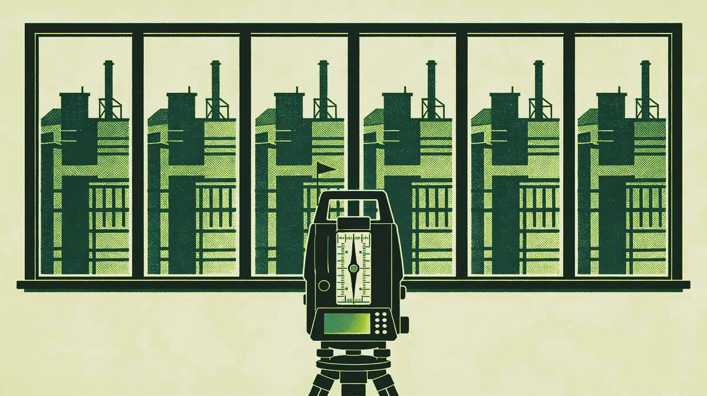

La mayoría de empresas B2B que contrata a un CMO fraccional lo hace porque no puede permitirse uno a tiempo completo. Ese es el motivo equivocado, y lleva al resultado equivocado.

Cuando el brief es "danos la experiencia de un CMO full-time a mitad de coste", acabas con una versión aguada de algo. Menos horas, menos contexto, decisiones más lentas. Eso no es una ventaja competitiva. Es un apaño.

Las empresas que sacan valor real del modelo fraccional son las que lo abordan de otra manera. No están comprando un rol full-time con descuento. Están comprando algo que una contratación a tiempo completo, sinceramente, no puede ofrecer.

## Lo que un CMO full-time no te puede dar

Un CMO a tiempo completo, por definición, solo ha trabajado dentro de tu empresa. Su marco de referencia es tu mercado, tu equipo, tu historia, tus políticas internas.

Eso es valioso para muchas cosas. Es un lastre para otras.

Cuando necesitas a alguien que cuestione los supuestos que se han calcificado en tu organización durante años —el targeting que nadie discute, los mensajes que "siempre funcionaron", el mix de canales que no ha cambiado desde 2019— la mirada de dentro es una desventaja.

Un CMO fraccional que ha trabajado en 8 a 12 empresas B2B en los últimos tres años trae algo distinto: una visión actual y calibrada de lo que de verdad funciona en el mercado. No teoría. No un framework de una conferencia. Reconocimiento de patrones real, sacado de situaciones reales.

Ha visto tu problema antes. Normalmente más de una vez. Sabe qué soluciones lucen bien sobre el papel y se caen en la práctica. Sabe qué quick wins son de verdad rápidas y cuáles tardan seis meses digan lo que digan.

## El problema de la seniority en empresas en crecimiento

Hay un momento concreto en el crecimiento de una empresa B2B en el que el modelo fraccional tiene más sentido. Es la brecha entre "marketing es quien lleva la web y los eventos" y "necesitamos una función de marketing en condiciones, con liderazgo de verdad".

En esta etapa, una contratación senior a tiempo completo suele ser el movimiento equivocado. No porque la empresa no pueda beneficiarse de un liderazgo de marketing senior —desde luego que puede—, sino porque un CMO full-time en esta etapa necesita que la empresa esté lista para apoyarlo: un equipo que dirigir, un presupuesto del que ser dueño, una infraestructura comercial en la que trabajar.

Si esas cosas no están, estás pagando salario senior para que alguien dedique sus primeros seis meses a averiguar dónde se ha metido.

Un CMO fraccional puede hacer ese trabajo de diagnóstico en semanas, no en meses. Puede construir la estrategia, definir la estructura del equipo, fijar el marco de presupuesto y establecer las métricas comerciales, y luego pasárselo a una contratación a tiempo completo que se incorpora a una función lista para funcionar, no a una que tiene que construir desde cero.

Eso no es un apaño. Es una secuenciación más inteligente de la inversión.

## Qué buscar, y qué evitar

No todos los CMO fraccionales son iguales, y el mercado se ha llenado de consultores que se han reetiquetado.

La diferencia importa. Un consultor entrega un documento. Un CMO fraccional responde por resultados. Está en tus reuniones de dirección. Toma decisiones, no solo hace recomendaciones. Se juega algo.

Cuando estés evaluando el modelo, hazte tres preguntas:

**¿Cómo es la rendición de cuentas?** Si la respuesta es un informe mensual, sigue buscando. Quieres a alguien que aparezca en tus forecast calls, que se incomode cuando el pipeline va corto, que plante cara tanto al equipo de ventas como al de marketing.

**¿Qué profundidad B2B tiene?** El marketing B2B es una disciplina distinta del B2C. Los ciclos de compra son más largos, los interlocutores son múltiples, el contenido tiene que trabajar más. Alguien que hizo su carrera en marcas de consumo se gastará tu dinero aprendiendo cosas que ya debería saber.

**¿Cómo gestiona la transición?** Los mejores CMO fraccionales se construyen a sí mismos fuera del puesto. Desde el primer día piensan en cómo debe verse el equipo dentro de 12 meses, y en cómo llegar ahí sin crear una dependencia de su implicación continuada.

## La versión honesta

El modelo fraccional no encaja con cualquier empresa. Si necesitas a alguien integrado a tiempo completo, gestionando un equipo grande y construyendo conocimiento institucional a largo plazo, contrata full-time.

Pero si estás en un punto de inflexión, necesitas pensamiento senior más rápido de lo que permite un proceso de selección, o quieres desriesgar una inversión de marketing importante antes de comprometerte con un salario a tiempo completo, el modelo fraccional, bien hecho, no es un premio de consolación.

Es una elección deliberada. Y las empresas que la toman de forma deliberada tienden a sacarle mucho más.

---

*Trabajamos con un número reducido de empresas B2B como liderazgo de marketing fraccional. Si estás pensando en cómo podría ser eso para tu negocio, hablemos.*
