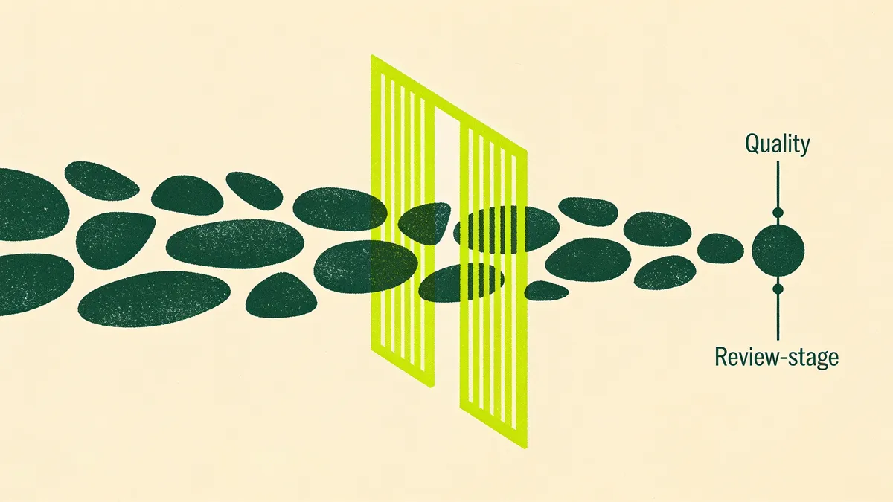

Ask a B2B marketing team if they use AI and almost all of them will say yes. Push a little further and the answer gets thinner. What "we use AI" usually means is that someone on the team opens a chat window, types a prompt, gets a decent paragraph back, and pastes it into a doc. Then they do it again the next day, from scratch, remembering none of what worked last time. That's not an AI workflow. It's a party trick. Impressive at the meeting, worthless by Friday.

The gap between those two things, the prompt and the workflow, is where almost all the real value lives. And it's the gap most teams never cross.

## The Model Isn't the Advantage. Everyone Has the Same One.

Here's the uncomfortable part. The model you're using is, more or less, the same model your competitor is using. Same underlying capability, same public tools, same monthly subscription. If your entire AI strategy is "we have access to a good model," you have no strategy. So does everyone else.

The advantage was never going to come from the model. It comes from what you build around it. The inputs you feed it, the steps you chain together, the checks you put in place, the point where a human takes over. That's the part nobody can copy off you, because it's specific to how your team actually works. The model is the engine. The workflow is the car. Nobody wins a race by owning an engine that sits on the garage floor.

So the real question isn't "are we using AI." It's "have we turned any of this into something that runs the same way every time." Most teams haven't. They're stuck at the prompt.

## Prompt vs. Pipeline: The Distinction That Changes Everything

A prompt is a single manual keystroke. You type it, you get an output, you move on. It lives in your head and your chat history. Nobody else can run it, and even you can't run it twice the same way, because you'll phrase it slightly differently and get a slightly different result. It doesn't improve. It just happens, over and over, forever.

A pipeline is a chained, repeatable process. It has defined inputs, a sequence of steps, a quality gate, and a human checkpoint. It runs the same way whether you're doing it or your new hire is doing it on their second week. And here's the part that matters most: a pipeline compounds. Every time you run it, you can tighten the input, sharpen a step, catch a failure mode you didn't see before. The prompt starts from zero every time. The pipeline gets better every time.

That's the whole game. You're not trying to write better prompts. You're trying to turn the good prompts you already have into pipelines that keep working after you've forgotten what you typed.

## Five Workflows a Small Team Can Ship This Quarter

None of these require a data team, a big budget, or a six-month roadmap. They're the shape of things a two-to-five person marketing team can stand up in a quarter.

**Research-to-brief.** You feed in a topic, a target ICP, and a couple of source links. The workflow pulls the key points, cross-references them against your positioning, and produces a structured content brief: angle, headline options, the argument, the proof points to gather. What used to be an afternoon of tab-hopping becomes a first draft of thinking that a human then sharpens.

**Content repurposing, one asset to many.** You have a good webinar, a strong long-form post, a customer conversation. The workflow takes that single source and produces the LinkedIn version, the newsletter section, the short-form hooks, the email nurture snippet. Same substance, reshaped for each surface. This is where small teams get the most obvious leverage, because the bottleneck was never ideas. It was the hours to reformat one idea into eight places.

**First draft, then human edit.** The model writes the first pass against a tight brief and your voice guidelines. A human does what humans are actually good at: killing the generic sentences, adding the one specific detail only you know, and deciding whether the argument is even true. The draft is a starting line, never a finish line.

**Personalization at scale for outbound.** Instead of the same cold email to 500 people, the workflow takes an account list and drafts a genuinely relevant opening line per account, based on a real signal. A human reviews the batch, kills the ones that misfired, and sends. Not "Hi {FirstName}." Actually specific, at a volume a human alone couldn't reach.

**Reporting and ops automation.** The weekly numbers that someone dreads assembling every Monday: the workflow pulls them, structures them, and drafts the plain-language summary of what moved and why. A human sanity-checks and adds the judgment. The team gets its Monday morning back.

Let me walk one all the way through, because the shape matters more than the list.

## What One Pipeline Actually Looks Like End to End

Take content repurposing. The input contract is explicit: a source asset over 800 words, plus a one-line note on the target audience and the single takeaway you want to lead with. No source, no run. That contract is what keeps garbage from entering the system, because a vague input produces vague output every time, and no clever prompt saves you from a bad brief.

Step one, the workflow extracts the core argument and the three or four proof points. Step two, it drafts each output format against a template you've defined for that channel, not a generic "write a LinkedIn post." Step three, it flags anything it couldn't source from the original, so you know what's inference and what's grounded. Then it stops. It doesn't publish. It hands a human a clean batch with the flags attached.

The human edits, approves, and the thing that made this a pipeline and not a party trick is that every edit teaches you something. The recurring fix becomes a rule in the template. The failure mode you keep catching becomes a step in the quality gate. Three months in, the workflow is producing output that needs half the editing it needed on day one. That's the compounding a prompt can never give you.

## What Separates a Pipeline From Slop

The difference between a workflow that produces real work and one that produces plausible garbage comes down to four things, and none of them are the prompt.

A clear input contract. If the workflow accepts anything, it produces anything. Define what a valid input looks like and reject what isn't. Most bad AI output is a bad input problem wearing a costume.

A human in the loop, at the right point. Not rubber-stamping at the end. Editing where judgment actually lives: is this true, is this on-brand, does this argument hold. The model is fast and confident and occasionally, fluently wrong. The human is the part that knows the difference.

A quality gate. A checklist the output has to clear before it ships. Sourced claims, no invented statistics, matches the voice, says something a competitor couldn't have said. If it fails the checklist, it goes back, it doesn't go out.

Versioning. You keep the workflow, not just the output. When something breaks, you can see what changed. When something works, you can reuse it. A pipeline you can't inspect is just a slower party trick.

And the thing worth saying plainly: don't remove the human from the judgment step. Automate the assembly, the reformatting, the first draft, the tab-hopping. Never automate the decision about whether something is true, on-brand, or worth sending. That's not caution for its own sake. It's the line between compounding and embarrassment.

## The Plumbing Is the Point

The teams pulling ahead with AI right now aren't the ones with a secret model. There is no secret model. They're the ones who did the unglamorous work of turning a handful of good prompts into a handful of reliable pipelines, with contracts and gates and a human where it counts.

That's genuinely available to a small team this quarter. You don't need scale. You need to pick one workflow, define the input, build the steps, put the gate in place, and run it enough times that it starts to compound. Then pick the next one.

Everyone has the engine. Almost nobody builds the car. That's the whole opportunity.

---

*At The B2B Tinkerers, we help B2B teams turn AI from a party trick into pipelines that actually ship work. If you want to operationalize AI instead of just talking about it, see how we [approach AI strategy](/services/ai-strategy), or [let's talk](#contact).*
