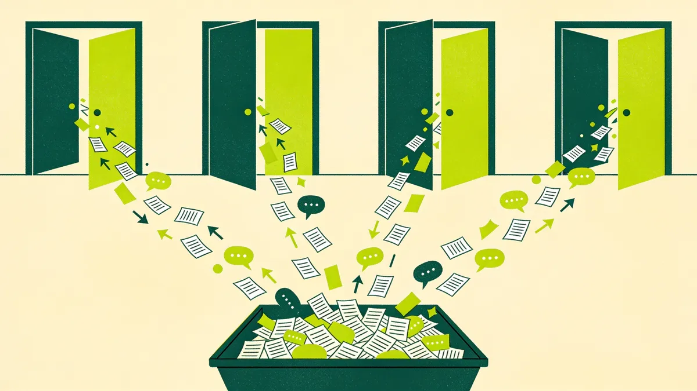

It's 9:14 on a Monday. Sales just pinged you for a one-pager they need "by end of day" for a call that, apparently, is happening tomorrow. The CEO wants a LinkedIn post about an industry award before lunch. There's an event next week and the booth graphics still aren't approved. And the campaign you actually planned for this sprint, the one tied to the quarter's pipeline target, slips again. Third week running.

Sound familiar?

This is firefighting mode. And here's the uncomfortable truth: most B2B marketing teams don't visit it occasionally. They live there. It becomes the permanent operating state, so normal that nobody questions it anymore. The team is busy, stressed, and productive-looking. And almost none of the work moves the business forward.

The instinct, when you're in this state, is to assume you need more people. You don't. Or at least, not yet.

## Firefighting Isn't a Workload Problem. It's an Operating-System Problem.

Here's the trap. When a team is drowning, "we need another headcount" feels like the obvious answer. But if you drop a new hire into a team that has no system for how work arrives, gets prioritized, and gets done, you don't get relief. You get a second firefighter running to the same fires.

The volume of requests isn't what's breaking your team. It's the absence of a mechanism to control that volume. Most marketing functions have a content strategy, a brand guide, maybe a campaign calendar. What they almost never have is an **operating system**: the boring, unglamorous machinery that decides what the team works on, in what order, and what it deliberately doesn't do.

Without it, every request is processed the same way: as an emergency, in the order it shouted loudest. That's not a team. That's a queue with no bouncer.

## The Three Doors Your Work Comes Through (And Why They're All Unlocked)

Look at how work actually reaches your team this week. I'd bet it comes through at least three doors, all wide open.

There's the Slack DM: a colleague messages someone on your team directly, and now that person has a task nobody else can see. There's the hallway ask, or its remote equivalent, the "quick favor" dropped in a meeting that turns into six hours of design work. And there's the exec override: leadership goes straight to a team member, and suddenly everything reshuffles because the request came from someone senior.

Each of these bypasses any notion of priority. The work doesn't get evaluated against anything. It just enters the system and starts consuming capacity, invisibly. Nobody is deciding *this matters more than that*. The requests are simply arriving, and your team is absorbing all of them.

You cannot prioritize what you can't see. And right now, half your team's workload is invisible, scattered across DMs and side conversations, never touching a single shared surface where a trade-off could be made.

## Why Everything Is "Urgent" and Nothing Is Important

When there's no framework for priority, one rule quietly takes over: the loudest stakeholder wins. Urgency becomes a social negotiation rather than a business decision. The person who pushes hardest, or sits highest on the org chart, gets their work done first, regardless of what it's actually worth to the company.

The result is a team that's permanently reactive. Everything is labeled P1, which is the same as saying nothing is. Real priorities, the two or three initiatives that would genuinely move pipeline this quarter, get buried under a landslide of small, loud, "urgent" tasks that each felt reasonable in isolation.

And the strategic work? It never has a deadline screaming at it. The brand project, the positioning refresh, the nurture sequence that would actually compound over time, these have no angry stakeholder in Slack. So they're always the thing that gets bumped. Perpetually important, never urgent, forever undone.

## The Hidden Tax Nobody Puts on the Invoice

There's a cost to all this that never shows up in a report, and it's brutal: context switching.

Every time someone on your team drops the campaign to make the "quick" one-pager, then jumps to the CEO's LinkedIn post, then back to the campaign, they pay a tax. Research from the American Psychological Association found that shifting between tasks can cost as much as 40% of someone's productive time. Forty percent. That's not the time spent on the tasks. That's pure loss, burned in the switching itself, in reloading context and remembering where you were.

So a team that looks fully utilized, everyone busy, everyone shipping, might be operating at a fraction of its real capacity. Not because people aren't working hard. Because the system forces them to work in fragments.

This is where a concept from software teams earns its place in marketing: **work-in-progress limits**. The idea is counterintuitive but proven. When you cap how many things can be "in flight" at once and force the team to finish before starting, throughput goes *up*, not down. Fewer things at a time means each thing gets done faster, with fewer errors, and fewer half-finished projects rotting in the backlog. Starting is easy. Finishing is what creates value.

## Building the Operating System

So how do you actually get out? Not with a new tool. With a system. Here's the minimum viable version.

**Build one front door.** Every request, no exceptions, goes to a single intake: one form, one board, one channel. If it didn't come through the front door, it doesn't exist. This single move makes the invisible workload visible for the first time, which is the precondition for everything else.

**Run a weekly triage.** Once a week, someone who owns prioritization looks at everything in the intake and decides what's in, what's out, and in what order. Not the loudest voice. A designated owner, applying a consistent lens: does this connect to a business outcome we care about this quarter?

**Set WIP limits.** Decide how many projects the team can genuinely hold at once, and hold the line. When something new comes in that matters, something else has to come out. You make the trade-off explicit instead of silently piling it on.

**Make the board visible.** Put the work, and the queue, on a surface everyone can see. When a stakeholder asks for something urgent, you don't say no. You show them the board and ask what they'd like to bump. Nine times out of ten, "urgent" evaporates the moment there's a visible cost attached to it.

**Protect a capacity buffer.** Real fires happen. A genuine PR issue, a product launch that moves up. Don't plan the team to 100%. Leave room, so a real emergency doesn't detonate the entire plan.

## Rituals, Not Tools

Here's the part people get wrong. They think the answer is buying Asana, or Monday, or Jira, and the chaos will sort itself out. It won't. A backlog that nobody grooms is just a graveyard with better formatting. The tool is inert without the ritual.

What actually changes the team is the *cadence*: the weekly triage that genuinely happens, the WIP limit that's genuinely enforced, the front door that leadership genuinely respects. The discipline lives in the recurring human decisions, not in the software. You could run all of this on a whiteboard and a standing 30-minute Monday meeting and outperform a team with a $50,000 (€45,000) enterprise platform and no discipline.

The best B2B marketing teams I've seen aren't the busiest. They're the calmest. Not because they have less work, but because they decided, in advance and out loud, what they would and wouldn't do. They traded the adrenaline of constant firefighting for the quiet compounding of finishing what matters.

Your team is capable of that. It's probably not a talent problem, and it's probably not a headcount problem. It's a systems problem. And systems, unlike fires, are something you can actually build.

---

*At The B2B Tinkerers, we help B2B marketing teams trade chaos for a system that lets them ship the work that matters. If your team feels permanently reactive, [let's talk](/contact).*
