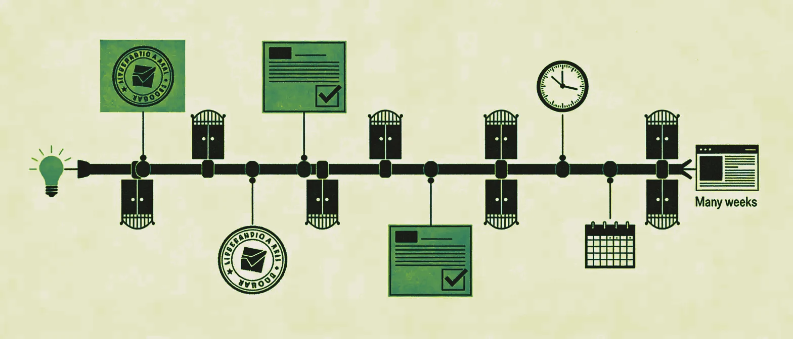

Hay una conversación que se repite una y otra vez. Un equipo de marketing B2B quiere publicar una nueva landing page. Abre un ticket. Espera. La agencia pide un brief. Se programa un sprint. Dos semanas después, la página sale en vivo. Para cuando se publica, la campaña para la que se construyó ya ha pasado de página.

La plataforma que bloquea ese proceso suele tener un nombre familiar: Sitecore. O Contentful Enterprise. O Adobe Experience Manager. O la solución que alguien justificó en su día ante el comité de dirección como "la opción escalable a largo plazo".

El problema no es que estas plataformas sean malas. El problema es que, para la mayoría de empresas B2B, son brutalmente inadecuadas.

---

## El coste real que nadie pone sobre la mesa

Cuando una empresa decide implementar Sitecore, los presupuestos iniciales que circulan en las presentaciones internas rara vez cuentan toda la historia.

La realidad documentada es esta: implementar Sitecore en un entorno enterprise puede costar entre 200.000 € (220.000 $) en la parte baja —para despliegues sencillos— y bastante más de 1 M€ (1,1 M$) cuando entran en juego la personalización avanzada, las integraciones con CRM y ERP, la migración de contenido y la formación del equipo. La licencia anual sola ronda de media los 70.000 € (77.000 $), llegando a 360.000 € (400.000 $) en escenarios de alto tráfico.

Y eso es solo el principio. Después viene el coste operativo: perfiles especialistas en .NET para mantener la plataforma, agencias certificadas para cualquier modificación de calado, ciclos de upgrade que pueden congelar el sitio durante semanas. Un equipo de marketing medio apenas puede tocar nada sin ayuda externa.

Contentful, presentado normalmente como la alternativa más ágil y headless, tiene su propia contabilidad incómoda. El plan Premium arranca en 60.000 $ al año a precio de tarifa. Las configuraciones Enterprise con múltiples spaces y soporte Platinum pueden superar los 400.000 $ anuales. A eso se suman los costes de implementación —entre 10.000 $ y 50.000 $ para proyectos de tamaño medio— y el tiempo de desarrollo de frontend, que no está incluido en ninguna de esas cifras.

La pregunta que nadie hace en la sala de reuniones es esta: ¿qué objetivo de negocio concreto justifica este gasto frente a las alternativas disponibles hoy?

---

## El argumento de la escalabilidad ya no vale como excusa

Durante años, la respuesta a esa pregunta fue "escalabilidad" e "integraciones". Sitecore podía gestionar 50 sites en múltiples idiomas. Podía personalizar experiencias en tiempo real. Podía integrarse con cualquier CRM del mercado.

Todo eso era cierto. Y para un fabricante multinacional con presencia en 30 países y un equipo digital de 40 personas, probablemente sigue teniendo sentido. Pero la mayoría de empresas B2B que compraron estas plataformas entre 2015 y 2022 no eran eso. Eran negocios de tamaño medio con un equipo de marketing de tres a ocho personas, un mercado principalmente nacional o regional, y una web corporativa cuyo trabajo principal era generar leads y publicar contenido.

Para ese caso de uso, gastar entre 200.000 € (220.000 $) y 1 M€ (1,1 M$) en implementación y decenas de miles al año en licencias y soporte es, sencillamente, un error de juicio que los presupuestos inflados de aquella época hicieron posible.

En 2026, ese error ya no solo es caro. Es competitivamente peligroso.

---

## Qué necesita de verdad un equipo de marketing moderno de su web

Si le quitas el ruido a los roadmaps de los proveedores y a las presentaciones de las agencias, las necesidades reales de un equipo de marketing B2B son sorprendentemente sencillas:

Publicar contenido nuevo —artículos, landing pages, casos de cliente— sin depender de un desarrollador. Crear y modificar formularios de captación de leads cuando cambia una campaña. Iterar sobre la home y las páginas de producto cuando evoluciona el posicionamiento. Medir tráfico, conversión y comportamiento del visitante. Conectar la web con el CRM sin un proyecto de integración de seis meses. Y hacer todo esto con un equipo pequeño, en días, no en semanas.

Ninguna de estas necesidades requiere Sitecore. De hecho, Sitecore a menudo las hace más difíciles, porque la complejidad de la plataforma convierte cada cambio en un proyecto.

---

## Las alternativas que merece la pena considerar en 2026

El mercado ha madurado considerablemente. Ahora hay plataformas que cubren las necesidades reales de marketing de las empresas B2B a una fracción del coste, con un modelo operativo que un equipo sin perfiles técnicos especialistas puede gestionar.

**HubSpot Content Hub** es la opción más integrada para equipos que ya operan dentro del ecosistema HubSpot. La web, el CRM, los formularios, los workflows de nurturing y el reporting viven todos en el mismo sitio. El coste total de propiedad es predecible, la curva de aprendizaje es manejable y el equipo de marketing puede publicar sin abrir un ticket. Sus principales limitaciones son la dependencia del ecosistema HubSpot y cierta rigidez a la hora del control avanzado del diseño.

**Webflow** ha redefinido lo que significa "control de diseño sin código". Un diseñador o un marketer con instinto visual puede construir páginas complejas, gestionar el CMS y publicar a producción sin escribir una sola línea de código. La velocidad de construcción inicial suele ser de tres a cinco veces más rápida que en plataformas como HubSpot. Su integración con HubSpot para la gestión de leads funciona bien, y su rendimiento técnico —SEO, Core Web Vitals, seguridad— está por encima de la mayoría de alternativas.

**Storyblok** es la opción headless que no sacrifica la autonomía del equipo de marketing. Su editor visual permite previsualizar cambios en tiempo real manteniendo la flexibilidad arquitectónica de un CMS desacoplado. Para empresas B2B con presencia en varios mercados que necesitan gestionar contenido localizado a escala, es una alternativa creíble a Contentful con una experiencia de edición mucho más accesible.

**Sanity** merece consideración para equipos con orientación técnica que quieren máxima flexibilidad en el modelado de contenido sin pagar las tarifas enterprise de Contentful. Es open source en su núcleo, con planes gestionados accesibles, e integra limpiamente con cualquier frontend moderno, incluido Astro.

**Framer** está ganando tracción entre los equipos de SaaS B2B que priorizan la calidad de diseño y la velocidad de ejecución sobre la complejidad funcional. No es una solución para webs con requisitos de contenido complejos, pero para una web de producto bien ejecutada con un blog integrado, el time-to-market es difícil de batir.

---

## El argumento de los agentes de IA cambia por completo el cálculo

Hay una variable que las evaluaciones de plataforma de hace tres años no podían tener en cuenta, y que en 2026 ya no se puede ignorar: los agentes de IA han cambiado de raíz la relación entre la capacidad del equipo y el output de marketing.

Un equipo de contenido B2B que antes requería cinco personas —estratega, redactor, especialista en SEO, diseñador, gestor de CMS— hoy puede operar con una o dos personas apoyadas por agentes especializados. Un agente redacta la primera versión. Otro optimiza para búsqueda. Un tercero adapta el formato a distintos canales. La persona del equipo dirige, edita y publica.

En ese modelo, la plataforma web debe ser el último obstáculo, no el primero. Una web construida sobre Sitecore o Contentful Enterprise —con sus ciclos de publicación lentos y su dependencia de perfiles técnicos externos— es incompatible con la velocidad que este tipo de stack de trabajo habilita.

Plataformas como HubSpot Content Hub, Webflow o Storyblok están diseñadas —o al menos se pueden configurar— para que publicar sea el paso más rápido de todo el proceso, no el cuello de botella.

---

## La decisión que hay que tomar ya

Si tu empresa B2B tiene una web sobre una plataforma enterprise que no puedes tocar sin llamar a una agencia, hay una conversación que tienes que tener con tu dirección. No sobre tecnología. Sobre coste de oportunidad.

Cada semana que tardas en publicar una landing page porque el proceso requiere un ticket, un sprint y una aprobación es tiempo de mercado que no recuperas. Cada mes que pagas en licencias y soporte por capacidades que no usas es presupuesto que no va al pipeline.

Una web B2B en 2026 no necesita ser cara de mantener. Necesita ser rápida de operar. La complejidad técnica que no se traduce en velocidad de marketing o en una mejor experiencia de compra es un lujo que casi ninguna empresa B2B se puede permitir.

Sitecore es una plataforma extraordinaria para quien la necesita. El problema es que la mayoría de las empresas que la compraron, probablemente, no la necesitaban.

---

*¿Tu equipo de marketing sigue esperando a IT o a una agencia para publicar contenido? En The B2B Tinkerers ayudamos a equipos B2B a auditar su stack digital y migrar a arquitecturas más ligeras sin perder capacidad. Hablemos.*
